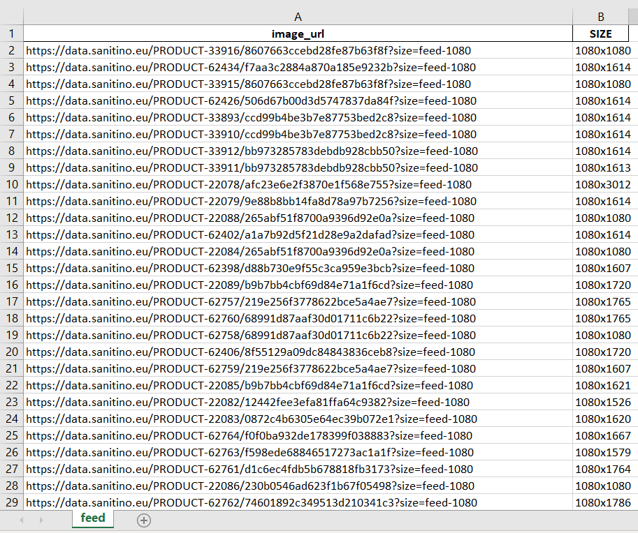

# Image sizes parser
Script for the parser of image extensions in Python:

1) Take all the url of the images in the file (there are more than 40k images); 
2) Take the size of the image expansion;
3) Fill in the “SIZE” column in the file where the image extension should be;
4) The result of the script in the Jupyter Notebook.

## Project Structure
* data/ - directory with result Excel files (*check out ImageSizeExample.xlsx*)
* logs/ - directory with log files
* notebooks/ - directory with Jupyter Notebook files (*check out image_sizes_analysis.ipynb*)
* scripts/ - directory with parsing scripts

## Installing

Python3 must be already installed

```shell
git clone https://github.com/LiudmylaKulinchenko/newspaper-agency.git  # clone project to your PK
cd image-sizer-parser/  # change directory to the project directory

python -m venv venv
venv\Scripts\activate  # (for Windows) create and activate virtual environment
venv/bin/activate  # (for Mac/Linux)

pip install -r requirements.txt  # install requirements
```

Afterwards you should go to `.env.sample` file and add your secret configurations.
Then change file name to `.env` and run the next command to run script and start parsing:

```python scripts/main.py```

You can also change `config.ini` file, if you want to change configurations. Be carefull and follow pattern!

To check out Jupyter Notebooks from your browser, you should run command:

```jupyter notebook```

## Result table demo


